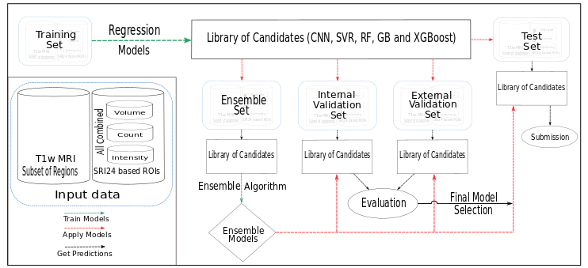

# Predicting Fluid Intelligence in Adolescent Brain MRI Data: An Ensemble Approach

**Shikhar Srivastava, Fabian Eitel, and Kerstin Ritter**

Source code for our team's submission in ABCD-NP Challenge 2019.

**Abstract:** Decoding fluid intelligence from brain MRI data in adolescents is a highly challenging task. In this study, we took part in the ABCD Neurocognitive Prediction (NP) Challenge 2019, in which a large set of T1-weighted magnetic resonance imaging (MRI) data  and pre-residualized fluid intelligence scores (corrected for brain volume, data collection site and sociodemographic variables) of children between 9-11 years were provided (N=3739 for training, N=415 for internal validation and N=4516 for testing). We propose here the Caruana Ensemble Search method to choose best performing models over a large and diverse set of candidate models. These candidate models include convolutional neural networks (CNNs) applied to brain areas considered to be relevant in fluid intelligence (e.g. frontal and parietal areas) and high-performing standard machine learning methods (namely support vector regression, random forests, gradient boosting and XGBoost) applied to region-based scores including volume, mean intensity and count of gray matter voxels. To further create diversity and increase robustness, a wide set of hyperparameter configurations for each of the models was used. On the internal validation data set, we obtained a mean squared error (MSE) of 71.15. Among most selected models were XGBoost together with the three region-based scores, the other regression models together with volume or CNNs based on the middle frontal gyrus. We discuss these results in light of previous research findings on fluid intelligence.

---

## Modeling Framework

## Code related details
Final codes used for generating results are in submission_codes folder.

1. For obtaining predictions using this approach please run the files in sequential number order (in file name).
2. Python 3.6 and R 3.4 were jointly used at various stages. Respective file types can be used for indication of which program to us.
3. Self created modules/functions are named as "util_xxxx". They are in the zip file as well.
4. Please set a path before running each file. Each file contains its own description.
5. The grid search parameters used for CNN models are also in the zip file.

## Requirements

External libraries or modules which were used are provided in "libraries.txt". Additionally, each script requires setting a `path` variable assigned to either data or model candidates' library. The specific instruction are provided in the scripts.

